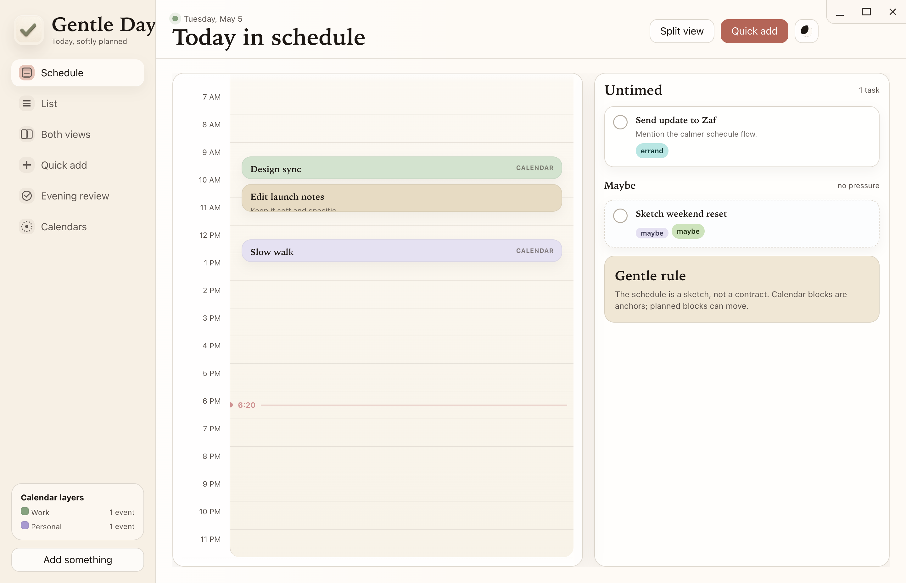
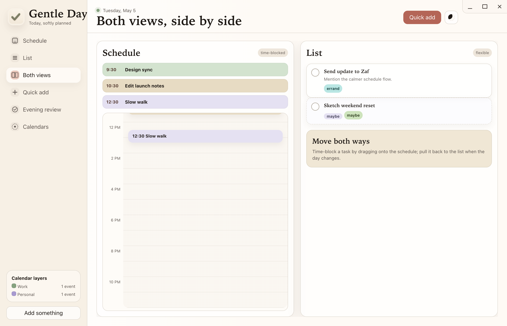
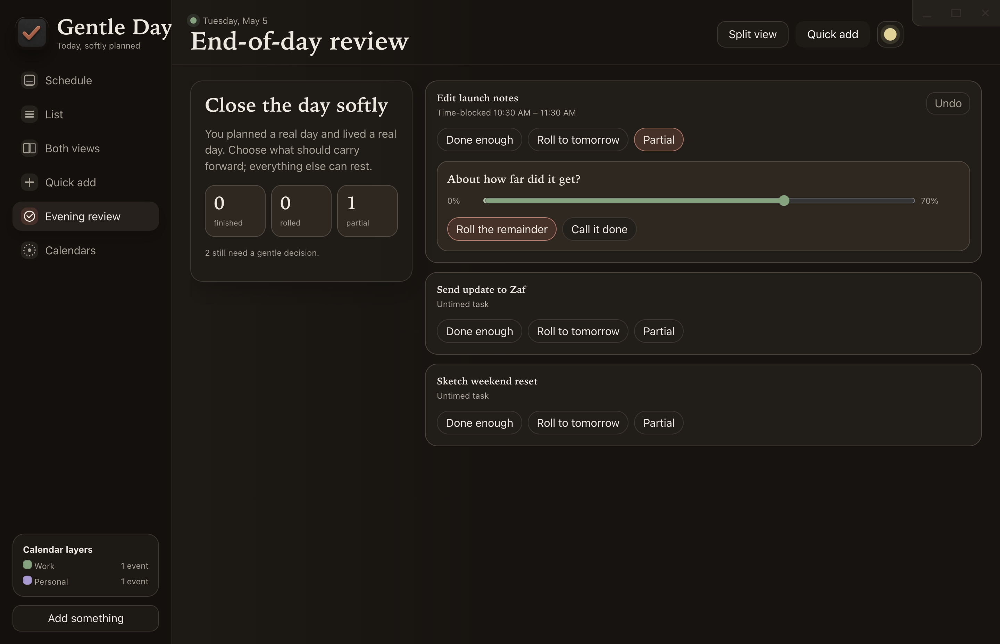

# Gentle Day

**Today, softly planned.**

Gentle Day is a calm desktop day planner for people who want structure without being boxed in. It keeps your day visible as a schedule, a list, or both side by side, with Google Calendar events as read-only anchors and your own tasks free to move.



## Download

The latest installers are on the official GitHub Release:

[Download Gentle Day v0.1.2](https://github.com/emmagine79/get-it/releases/tag/v0.1.2)

| Platform | File |
| --- | --- |
| Windows | `Gentle.Day-Setup-0.1.2-x64.exe` |
| macOS | `Gentle.Day-0.1.2-universal.dmg` |
| macOS alternate | `Gentle.Day-0.1.2-universal.zip` |

The macOS build is universal and supports both Apple Silicon and Intel Macs. The current builds are not code-signed yet, so Windows SmartScreen or macOS Gatekeeper may ask for confirmation the first time you open them.

## What It Feels Like

Gentle Day treats the schedule as a sketch, not a contract.

- **Schedule** gives the day a shape with soft time blocks, calendar context, drag-to-reschedule, and resize handles for changing duration.
- **List** keeps untimed work loose, so tasks can exist without becoming appointments.
- **Both views** lets you move between intention and flexibility without changing screens.
- **Quick add** previews the task as you type, including mode, time, and tags.
- **End-of-day review** gives unfinished work a soft landing: done enough, roll to tomorrow, or partial progress with undo.
- **Dark mode** is built in and persists between launches.



## Designed Around Real Days

Calendar events are context, not clutter. Connect Google Calendar and meetings appear as read-only blocks that help you see the shape of the day. Your own tasks stay separate, movable, and editable inside Gentle Day.

At the end of the day, review is deliberately gentle. You can mark what was finished, roll something forward, or record partial progress without pretending the day went perfectly.



## Privacy And Data

Gentle Day stores your planner data locally on your computer.

- Tasks, theme, calendar colors, and review history are stored in app local storage.
- Google OAuth tokens stay in the Electron main process user-data folder as `google-tokens.json`.
- Calendar events are read-only inside Gentle Day. Edit them in Google Calendar.
- Uninstalling or updating the app is configured not to delete app data.

## Google Calendar

Google Calendar is optional. You can skip it and use Gentle Day as a local planner.

To connect calendar sync in development or a custom build, create a Google Cloud OAuth Desktop client with the Calendar read-only scope:

```text
https://www.googleapis.com/auth/calendar.readonly
```

Save the downloaded OAuth client file as `credentials.json` in one of these places:

| Platform | Path |
| --- | --- |
| Project build | `<repo>/credentials.json` |
| macOS | `~/Library/Application Support/get-it/credentials.json` |
| Windows | `%APPDATA%\get-it\credentials.json` |
| Linux | `~/.config/get-it/credentials.json` |

The app checks the user-data folder first, then falls back to the bundled project file. Credentials and tokens are ignored by Git.

## Develop

You need Node.js 18 or later.

```bash
npm install
npm start
```

Run tests:

```bash
npm test
```

Build release artifacts:

```bash
npm run dist:win
npm run dist:mac
```

Generated installers are written to `release/`.

## Project Shape

```text
.
├── main.js          Electron main process, window setup, IPC, Google bridge
├── preload.js       Safe renderer bridge
├── google.js        Google OAuth and Calendar sync
├── renderer/
│   ├── app.js       Boot, navigation, theme, Google handlers
│   ├── screens.js   App screens and edit/review flows
│   ├── state.js     Local state store and migrations
│   ├── dragdrop.js  Schedule/list drag behavior
│   ├── modal.js     Modal shell
│   └── styles.css   Visual system
└── tests/           Node test coverage for logic and UI contracts
```

## Release Notes

`v0.1.2` replaces the app and in-app icons with the approved Gentle Day artwork while preserving the existing local data identity from earlier releases.
